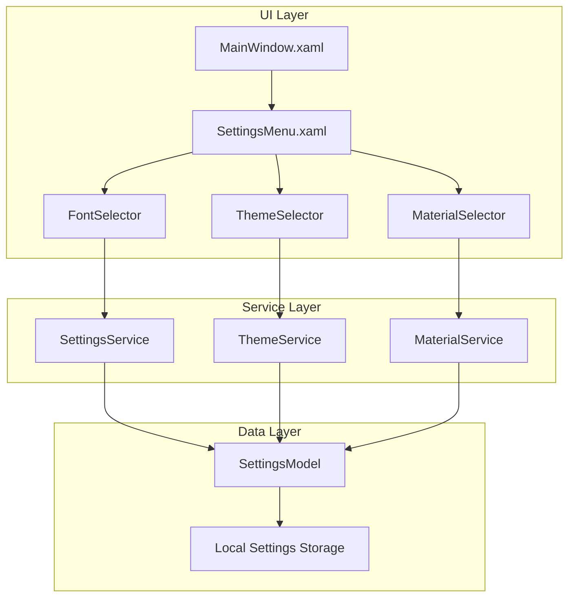
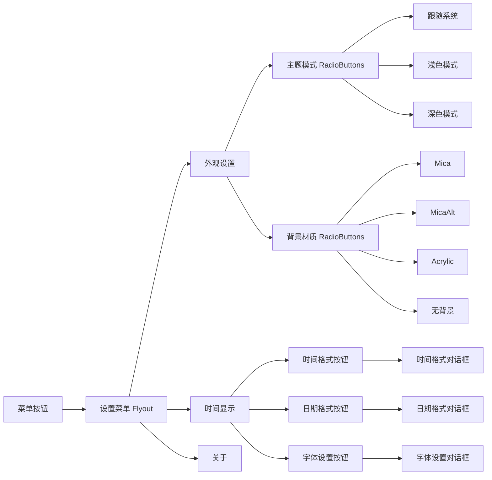
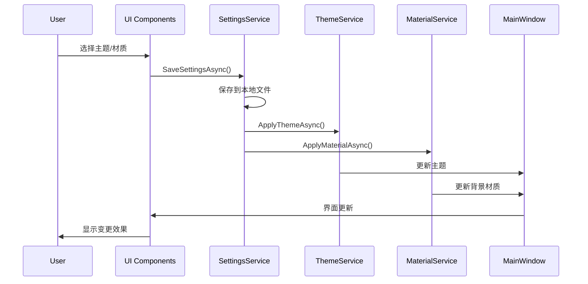
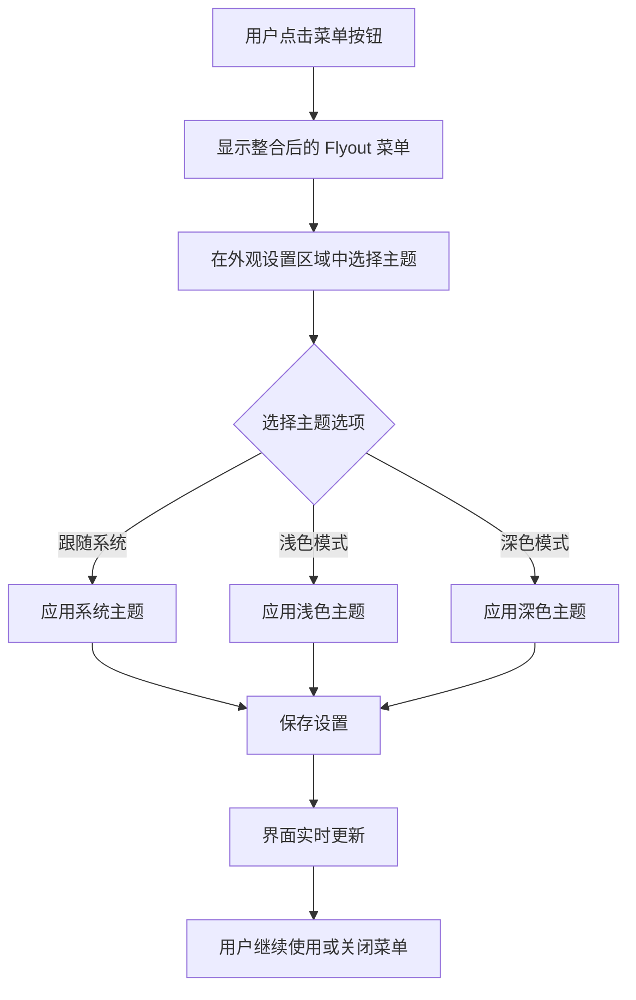
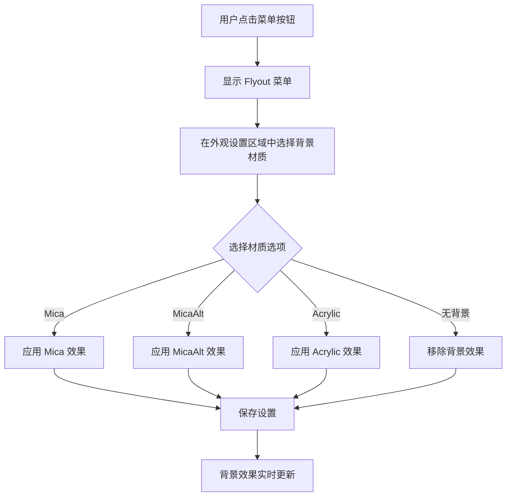
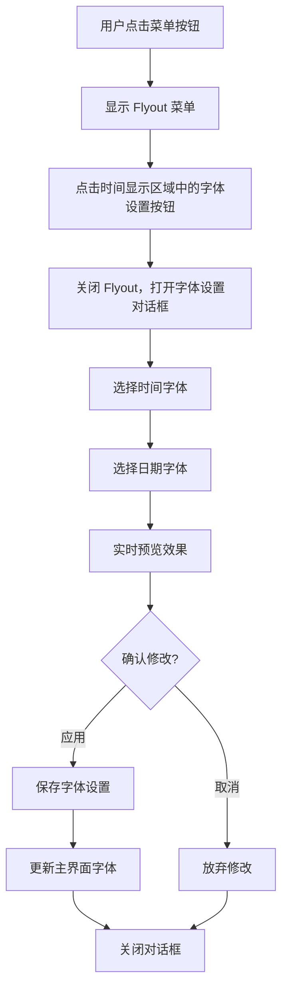

# 菜单样式自定义功能设计文档

## 1. 概述

### 功能描述
为 WinTimeBoard 应用程序添加菜单样式自定义功能，允许用户个性化配置应用外观和时间显示格式。该功能将通过菜单界面提供以下自定义选项：
- 深浅色调整（默认跟随系统）
- 背景材质调整（Mica、MicaAlt、Acrylic、无四个选项，默认为Mica）
- 时间/日期字体及格式调整

### 技术背景
项目基于 WinUI 3 框架，目前已实现基础的 Mica 背景效果和时间显示功能。需要扩展现有菜单系统以支持样式自定义功能。

## 2. 技术栈与依赖

### 现有技术栈
- **框架**: WinUI 3 (Microsoft.WindowsAppSDK 1.8.250916003)
- **平台**: .NET 10.0-windows10.0.26100.0
- **最低支持**: Windows 10 版本 17763
- **架构**: x86, x64, ARM64

### 新增依赖
```xml
<!-- 配置存储 -->
<PackageReference Include="Microsoft.Extensions.Configuration.Json" Version="8.0.0" />
<PackageReference Include="Microsoft.Extensions.Options" Version="8.0.0" />
```

## 3. 架构设计

### 整体架构图



### 组件架构

#### 3.1 UI 组件层
- **MainWindow**: 主窗口，集成设置菜单入口
- **SettingsMenu**: 设置菜单面板，包含所有自定义选项
- **ThemeSelector**: 主题选择器组件
- **MaterialSelector**: 背景材质选择器组件
- **FontSelector**: 字体和格式选择器组件

#### 3.2 服务层
- **SettingsService**: 配置管理服务，负责设置的读取、保存和应用
- **ThemeService**: 主题管理服务，处理深浅色主题切换
- **MaterialService**: 背景材质管理服务，处理不同背景效果的应用

#### 3.3 数据层
- **SettingsModel**: 配置数据模型
- **Local Settings Storage**: 本地配置存储，使用 JSON 文件

## 4. 数据模型设计

### 4.1 设置数据模型

```csharp
public class AppSettings
{
    public ThemeSettings Theme { get; set; } = new();
    public MaterialSettings Material { get; set; } = new();
    public TimeDisplaySettings TimeDisplay { get; set; } = new();
}

public class ThemeSettings
{
    public ThemeMode Mode { get; set; } = ThemeMode.FollowSystem;
}

public class MaterialSettings
{
    public BackgroundMaterial Material { get; set; } = BackgroundMaterial.Mica;
}

public class TimeDisplaySettings
{
    public string TimeFormat { get; set; } = "HH:mm:ss";
    public string DateFormat { get; set; } = "yyyy年MM月dd日 dddd";
    public FontSettings TimeFont { get; set; } = new();
    public FontSettings DateFont { get; set; } = new();
}

public class FontSettings
{
    public string FontFamily { get; set; } = "Microsoft YaHei UI";
    public double FontSize { get; set; } = 96;
    public FontWeight FontWeight { get; set; } = FontWeights.Bold;
}
```

### 4.2 枚举定义

```csharp
public enum ThemeMode
{
    FollowSystem,
    Light,
    Dark
}

public enum BackgroundMaterial
{
    None,
    Mica,
    MicaAlt,
    Acrylic
}
```

## 5. 用户界面设计

### 5.1 菜单结构设计

整合后的菜单将在现有的“关于”信息上方添加设置选项：



### 5.2 现有菜单结构分析

当前 MainWindow.xaml 中的菜单使用的是简单的 Flyout + StackPanel 结构：

```xml
<!-- 现有菜单结构 -->
<Button x:Name="MenuButton" FontFamily="Segoe Fluent Icons" Content="&#xE700;" Width="40" Height="40">
    <Button.Flyout>
        <Flyout Placement="Top" x:Name="MenuFlyout">
            <StackPanel Padding="8">
                <!-- 关于 -->
                <TextBlock Text="关于" FontSize="28" FontWeight="Bold" Margin="0,0,0,8"/>
                <StackPanel Margin="8,0,0,0">
                    <TextBlock x:Name="AppNameText" Text="WinTimeBoard BETA"/>
                    <TextBlock Text="Copyright © 2025 Shihao Shen. All rights reserved." Margin="0,8,0,0"/>
                </StackPanel>
            </StackPanel>
        </Flyout>
    </Button.Flyout>
</Button>
```

### 5.3 整合后的菜单设计

#### 方案一：扩展现有 Flyout 结构

为了保持与现有代码的兼容性，我们将在现有的 Flyout 中添加设置选项：

```xml
<Button x:Name="MenuButton" FontFamily="Segoe Fluent Icons" Content="&#xE700;" Width="40" Height="40">
    <Button.Flyout>
        <Flyout Placement="Top" x:Name="MenuFlyout">
            <ScrollViewer MaxHeight="400" VerticalScrollBarVisibility="Auto">
                <StackPanel Padding="12" Spacing="16" MinWidth="280">
                    
                    <!-- 外观设置 -->
                    <StackPanel>
                        <TextBlock Text="外观设置" FontSize="20" FontWeight="SemiBold" Margin="0,0,0,8"/>
                        
                        <!-- 主题模式 -->
                        <StackPanel Margin="8,0,0,0" Spacing="4">
                            <TextBlock Text="主题模式" FontSize="14" FontWeight="Medium" Margin="0,0,0,4"/>
                            <RadioButtons x:Name="ThemeRadioButtons" SelectionChanged="ThemeRadioButtons_SelectionChanged">
                                <RadioButton Content="跟随系统" Tag="FollowSystem" IsChecked="True"/>
                                <RadioButton Content="浅色模式" Tag="Light"/>
                                <RadioButton Content="深色模式" Tag="Dark"/>
                            </RadioButtons>
                        </StackPanel>
                        
                        <!-- 背景材质 -->
                        <StackPanel Margin="8,0,0,0" Spacing="4">
                            <TextBlock Text="背景材质" FontSize="14" FontWeight="Medium" Margin="0,8,0,4"/>
                            <RadioButtons x:Name="MaterialRadioButtons" SelectionChanged="MaterialRadioButtons_SelectionChanged">
                                <RadioButton Content="Mica" Tag="Mica" IsChecked="True"/>
                                <RadioButton Content="MicaAlt" Tag="MicaAlt"/>
                                <RadioButton Content="Acrylic" Tag="Acrylic"/>
                                <RadioButton Content="无背景" Tag="None"/>
                            </RadioButtons>
                        </StackPanel>
                    </StackPanel>
                    
                    <Border Height="1" Background="{ThemeResource CardStrokeColorDefaultBrush}" Margin="-4,0"/>
                    
                    <!-- 时间显示设置 -->
                    <StackPanel>
                        <TextBlock Text="时间显示" FontSize="20" FontWeight="SemiBold" Margin="0,0,0,8"/>
                        
                        <StackPanel Margin="8,0,0,0" Spacing="8">
                            <Button x:Name="TimeFormatButton" 
                                    Content="时间格式设置" 
                                    HorizontalAlignment="Stretch"
                                    Click="TimeFormatButton_Click"/>
                            <Button x:Name="DateFormatButton" 
                                    Content="日期格式设置" 
                                    HorizontalAlignment="Stretch"
                                    Click="DateFormatButton_Click"/>
                            <Button x:Name="FontSettingsButton" 
                                    Content="字体设置" 
                                    HorizontalAlignment="Stretch"
                                    Click="FontSettingsButton_Click"/>
                        </StackPanel>
                    </StackPanel>
                    
                    <Border Height="1" Background="{ThemeResource CardStrokeColorDefaultBrush}" Margin="-4,0"/>
                    
                    <!-- 关于 -->
                    <StackPanel>
                        <TextBlock Text="关于" FontSize="20" FontWeight="SemiBold" Margin="0,0,0,8"/>
                        <StackPanel Margin="8,0,0,0">
                            <TextBlock x:Name="AppNameText" Text="WinTimeBoard BETA"/>
                            <TextBlock Text="Copyright © 2025 Shihao Shen. All rights reserved." 
                                      Margin="0,4,0,0" 
                                      Foreground="{ThemeResource TextFillColorSecondaryBrush}"/>
                        </StackPanel>
                    </StackPanel>
                    
                </StackPanel>
            </ScrollViewer>
        </Flyout>
    </Button.Flyout>
</Button>
```

#### 方案二：使用 MenuFlyout (可选方案)

如果希望使用更标准的菜单结构，可以替换为 MenuFlyout：

```xml
<Button x:Name="MenuButton" FontFamily="Segoe Fluent Icons" Content="&#xE700;" Width="40" Height="40">
    <Button.Flyout>
        <MenuFlyout x:Name="MainMenuFlyout" Placement="Top">
            <MenuFlyoutSubItem Text="外观设置">
                <MenuFlyoutSubItem.Icon>
                    <FontIcon Glyph="&#xE790;"/>
                </MenuFlyoutSubItem.Icon>
                
                <MenuFlyoutSubItem Text="主题模式">
                    <MenuFlyoutSubItem.Icon>
                        <FontIcon Glyph="&#xE706;"/>
                    </MenuFlyoutSubItem.Icon>
                    <ToggleMenuFlyoutItem x:Name="ThemeFollowSystem" Text="跟随系统" IsChecked="True" />
                    <ToggleMenuFlyoutItem x:Name="ThemeLight" Text="浅色模式" />
                    <ToggleMenuFlyoutItem x:Name="ThemeDark" Text="深色模式" />
                </MenuFlyoutSubItem>
                
                <MenuFlyoutSubItem Text="背景材质">
                    <MenuFlyoutSubItem.Icon>
                        <FontIcon Glyph="&#xF16A;"/>
                    </MenuFlyoutSubItem.Icon>
                    <ToggleMenuFlyoutItem x:Name="MaterialMica" Text="Mica" IsChecked="True" />
                    <ToggleMenuFlyoutItem x:Name="MaterialMicaAlt" Text="MicaAlt" />
                    <ToggleMenuFlyoutItem x:Name="MaterialAcrylic" Text="Acrylic" />
                    <ToggleMenuFlyoutItem x:Name="MaterialNone" Text="无背景" />
                </MenuFlyoutSubItem>
            </MenuFlyoutSubItem>
            
            <MenuFlyoutSubItem Text="时间显示">
                <MenuFlyoutSubItem.Icon>
                    <FontIcon Glyph="&#xE823;"/>
                </MenuFlyoutSubItem.Icon>
                <MenuFlyoutItem Text="时间格式..." Click="TimeFormatMenuItem_Click"/>
                <MenuFlyoutItem Text="日期格式..." Click="DateFormatMenuItem_Click"/>
                <MenuFlyoutItem Text="字体设置..." Click="FontSettingsMenuItem_Click"/>
            </MenuFlyoutSubItem>
            
            <MenuFlyoutSeparator />
            
            <MenuFlyoutItem Text="关于" Click="AboutMenuItem_Click">
                <MenuFlyoutItem.Icon>
                    <FontIcon Glyph="&#xE946;"/>
                </MenuFlyoutItem.Icon>
            </MenuFlyoutItem>
        </MenuFlyout>
    </Button.Flyout>
</Button>
```

#### 字体设置对话框

```xml
<ContentDialog x:Name="FontSettingsDialog" 
               Title="字体设置"
               PrimaryButtonText="应用"
               CloseButtonText="取消">
    <ScrollViewer MaxHeight="500">
        <StackPanel Spacing="16">
            <!-- 时间字体设置 -->
            <StackPanel>
                <TextBlock Text="时间字体" FontSize="16" FontWeight="SemiBold" Margin="0,0,0,8" />
                <ComboBox x:Name="TimeFontFamilyComboBox" 
                          Header="字体族" 
                          ItemsSource="{x:Bind FontFamilies}" 
                          SelectedItem="Microsoft YaHei UI"
                          MinWidth="200" />
                <Slider x:Name="TimeFontSizeSlider" 
                        Header="字体大小" 
                        Minimum="24" Maximum="200" Value="96" 
                        TickFrequency="8" TickPlacement="Outside" />
                <ComboBox x:Name="TimeFontWeightComboBox" 
                          Header="字体粗细" 
                          ItemsSource="{x:Bind FontWeights}" 
                          SelectedItem="Bold" />
            </StackPanel>
            
            <Border Height="1" Background="{ThemeResource CardStrokeColorDefaultBrush}" />
            
            <!-- 日期字体设置 -->
            <StackPanel>
                <TextBlock Text="日期字体" FontSize="16" FontWeight="SemiBold" Margin="0,0,0,8" />
                <ComboBox x:Name="DateFontFamilyComboBox" 
                          Header="字体族" 
                          ItemsSource="{x:Bind FontFamilies}" 
                          SelectedItem="Microsoft YaHei UI"
                          MinWidth="200" />
                <Slider x:Name="DateFontSizeSlider" 
                        Header="字体大小" 
                        Minimum="12" Maximum="72" Value="36" 
                        TickFrequency="4" TickPlacement="Outside" />
                <ComboBox x:Name="DateFontWeightComboBox" 
                          Header="字体粗细" 
                          ItemsSource="{x:Bind FontWeights}" 
                          SelectedItem="Normal" />
            </StackPanel>
            
            <Border Height="1" Background="{ThemeResource CardStrokeColorDefaultBrush}" />
            
            <!-- 预览区域 -->
            <StackPanel>
                <TextBlock Text="预览" FontSize="16" FontWeight="SemiBold" Margin="0,0,0,8" />
                <Border Background="{ThemeResource CardBackgroundFillColorDefaultBrush}" 
                        CornerRadius="4" Padding="12">
                    <StackPanel HorizontalAlignment="Center">
                        <TextBlock x:Name="PreviewTimeText" 
                                   Text="12:34:56" 
                                   FontFamily="{x:Bind TimeFontFamilyComboBox.SelectedItem}" 
                                   FontSize="48" 
                                   FontWeight="Bold" 
                                   HorizontalAlignment="Center" />
                        <TextBlock x:Name="PreviewDateText" 
                                   Text="2025年1月10日 星期五" 
                                   FontFamily="{x:Bind DateFontFamilyComboBox.SelectedItem}" 
                                   FontSize="18" 
                                   FontWeight="Normal" 
                                   HorizontalAlignment="Center" 
                                   Margin="0,4,0,0" />
                    </StackPanel>
                </Border>
            </StackPanel>
        </StackPanel>
    </ScrollViewer>
</ContentDialog>
```

#### 时间格式设置对话框

```xml
<ContentDialog x:Name="TimeFormatDialog" 
               Title="时间格式设置"
               PrimaryButtonText="应用"
               CloseButtonText="取消">
    <StackPanel Spacing="16">
        <TextBlock Text="选择时间显示格式" FontSize="14" />
        
        <RadioButtons x:Name="TimeFormatRadioButtons">
            <RadioButton Content="24小时制 (HH:mm:ss)" Tag="HH:mm:ss" IsChecked="True" />
            <RadioButton Content="24小时制 (HH:mm)" Tag="HH:mm" />
            <RadioButton Content="12小时制 (h:mm:ss tt)" Tag="h:mm:ss tt" />
            <RadioButton Content="12小时制 (h:mm tt)" Tag="h:mm tt" />
        </RadioButtons>
        
        <Border Height="1" Background="{ThemeResource CardStrokeColorDefaultBrush}" />
        
        <StackPanel>
            <TextBlock Text="自定义格式" FontSize="14" Margin="0,0,0,4" />
            <TextBox x:Name="CustomTimeFormatTextBox" 
                     Header="自定义格式字符串"
                     PlaceholderText="例如：HH:mm:ss" />
            <TextBlock Text="常用格式：HH(小时) mm(分钟) ss(秒) tt(AM/PM)" 
                       FontSize="11" 
                       Foreground="{ThemeResource TextFillColorSecondaryBrush}" 
                       Margin="0,4,0,0" />
        </StackPanel>
        
        <Border Height="1" Background="{ThemeResource CardStrokeColorDefaultBrush}" />
        
        <!-- 预览 -->
        <StackPanel>
            <TextBlock Text="预览" FontSize="14" Margin="0,0,0,4" />
            <Border Background="{ThemeResource CardBackgroundFillColorDefaultBrush}" 
                    CornerRadius="4" Padding="8">
                <TextBlock x:Name="TimeFormatPreviewText" 
                           Text="12:34:56" 
                           HorizontalAlignment="Center" 
                           FontFamily="Consolas" />
            </Border>
        </StackPanel>
    </StackPanel>
</ContentDialog>
```

#### 日期格式设置对话框

```xml
<ContentDialog x:Name="DateFormatDialog" 
               Title="日期格式设置"
               PrimaryButtonText="应用"
               CloseButtonText="取消">
    <StackPanel Spacing="16">
        <TextBlock Text="选择日期显示格式" FontSize="14" />
        
        <RadioButtons x:Name="DateFormatRadioButtons">
            <RadioButton Content="yyyy年MM月dd日 dddd" Tag="yyyy年MM月dd日 dddd" IsChecked="True" />
            <RadioButton Content="yyyy-MM-dd dddd" Tag="yyyy-MM-dd dddd" />
            <RadioButton Content="MM/dd/yyyy dddd" Tag="MM/dd/yyyy dddd" />
            <RadioButton Content="yyyy年MM月dd日" Tag="yyyy年MM月dd日" />
            <RadioButton Content="yyyy-MM-dd" Tag="yyyy-MM-dd" />
            <RadioButton Content="MM/dd/yyyy" Tag="MM/dd/yyyy" />
        </RadioButtons>
        
        <Border Height="1" Background="{ThemeResource CardStrokeColorDefaultBrush}" />
        
        <StackPanel>
            <TextBlock Text="自定义格式" FontSize="14" Margin="0,0,0,4" />
            <TextBox x:Name="CustomDateFormatTextBox" 
                     Header="自定义格式字符串"
                     PlaceholderText="例如：yyyy年MM月dd日" />
            <TextBlock Text="常用格式：yyyy(年) MM(月) dd(日) dddd(星期)" 
                       FontSize="11" 
                       Foreground="{ThemeResource TextFillColorSecondaryBrush}" 
                       Margin="0,4,0,0" />
        </StackPanel>
        
        <Border Height="1" Background="{ThemeResource CardStrokeColorDefaultBrush}" />
        
        <!-- 预览 -->
        <StackPanel>
            <TextBlock Text="预览" FontSize="14" Margin="0,0,0,4" />
            <Border Background="{ThemeResource CardBackgroundFillColorDefaultBrush}" 
                    CornerRadius="4" Padding="8">
                <TextBlock x:Name="DateFormatPreviewText" 
                           Text="2025年1月10日 星期五" 
                           HorizontalAlignment="Center" 
                           FontFamily="Microsoft YaHei UI" />
            </Border>
        </StackPanel>
    </StackPanel>
</ContentDialog>
```

## 6. 核心服务实现

### 6.1 设置服务 (SettingsService)

```csharp
public interface ISettingsService
{
    Task<AppSettings> LoadSettingsAsync();
    Task SaveSettingsAsync(AppSettings settings);
    Task ApplySettingsAsync(AppSettings settings);
    event EventHandler<AppSettings> SettingsChanged;
}

public class SettingsService : ISettingsService
{
    private readonly string _settingsPath;
    private AppSettings _currentSettings;
    
    public event EventHandler<AppSettings> SettingsChanged;
    
    public SettingsService()
    {
        _settingsPath = Path.Combine(
            Environment.GetFolderPath(Environment.SpecialFolder.LocalApplicationData),
            "WinTimeBoard", "settings.json");
    }
    
    public async Task<AppSettings> LoadSettingsAsync()
    {
        try
        {
            if (File.Exists(_settingsPath))
            {
                var json = await File.ReadAllTextAsync(_settingsPath);
                _currentSettings = JsonSerializer.Deserialize<AppSettings>(json) ?? new AppSettings();
            }
            else
            {
                _currentSettings = new AppSettings();
            }
        }
        catch
        {
            _currentSettings = new AppSettings();
        }
        
        return _currentSettings;
    }
    
    public async Task SaveSettingsAsync(AppSettings settings)
    {
        _currentSettings = settings;
        
        var directory = Path.GetDirectoryName(_settingsPath);
        if (!Directory.Exists(directory))
        {
            Directory.CreateDirectory(directory);
        }
        
        var json = JsonSerializer.Serialize(settings, new JsonSerializerOptions
        {
            WriteIndented = true
        });
        
        await File.WriteAllTextAsync(_settingsPath, json);
        SettingsChanged?.Invoke(this, settings);
    }
}
```

### 6.2 主题服务 (ThemeService)

```csharp
public interface IThemeService
{
    Task ApplyThemeAsync(ThemeMode themeMode);
    ThemeMode GetCurrentTheme();
}

public class ThemeService : IThemeService
{
    private readonly Window _window;
    
    public ThemeService(Window window)
    {
        _window = window;
    }
    
    public async Task ApplyThemeAsync(ThemeMode themeMode)
    {
        await _window.DispatcherQueue.EnqueueAsync(() =>
        {
            var content = _window.Content as FrameworkElement;
            if (content == null) return;
            
            switch (themeMode)
            {
                case ThemeMode.Light:
                    content.RequestedTheme = ElementTheme.Light;
                    break;
                case ThemeMode.Dark:
                    content.RequestedTheme = ElementTheme.Dark;
                    break;
                case ThemeMode.FollowSystem:
                default:
                    content.RequestedTheme = ElementTheme.Default;
                    break;
            }
        });
    }
}
```

### 6.3 背景材质服务 (MaterialService)

```csharp
public interface IMaterialService
{
    Task ApplyMaterialAsync(BackgroundMaterial material);
}

public class MaterialService : IMaterialService
{
    private readonly Window _window;
    
    public MaterialService(Window window)
    {
        _window = window;
    }
    
    public async Task ApplyMaterialAsync(BackgroundMaterial material)
    {
        await _window.DispatcherQueue.EnqueueAsync(() =>
        {
            switch (material)
            {
                case BackgroundMaterial.Mica:
                    _window.SystemBackdrop = new MicaBackdrop() 
                    { 
                        Kind = MicaKind.Base 
                    };
                    break;
                    
                case BackgroundMaterial.MicaAlt:
                    _window.SystemBackdrop = new MicaBackdrop() 
                    { 
                        Kind = MicaKind.BaseAlt 
                    };
                    break;
                    
                case BackgroundMaterial.Acrylic:
                    _window.SystemBackdrop = new DesktopAcrylicBackdrop();
                    break;
                    
                case BackgroundMaterial.None:
                default:
                    _window.SystemBackdrop = null;
                    break;
            }
        });
    }
}
```

## 7. 状态管理

### 7.1 设置状态流转图

```mermaid
stateDiagram-v2
    [*] --> Loading
    Loading --> Loaded: 加载完成
    Loading --> Default: 加载失败
    
    Loaded --> Editing: 用户修改设置
    Default --> Editing: 用户修改设置
    
    Editing --> Applying: 应用设置
    Applying --> Applied: 应用成功
    Applied --> Editing: 继续修改
    
    Applying --> Error: 应用失败
    Error --> Editing: 重试
```

### 7.2 设置应用流程



### 7.3 事件处理器实现

#### 主题切换事件处理

```csharp
private async void ThemeRadioButtons_SelectionChanged(object sender, SelectionChangedEventArgs e)
{
    if (sender is RadioButtons radioButtons && radioButtons.SelectedItem is RadioButton selectedRadio)
    {
        var themeMode = selectedRadio.Tag.ToString() switch
        {
            "FollowSystem" => ThemeMode.FollowSystem,
            "Light" => ThemeMode.Light,
            "Dark" => ThemeMode.Dark,
            _ => ThemeMode.FollowSystem
        };
        
        await _themeService.ApplyThemeAsync(themeMode);
        
        var settings = await _settingsService.LoadSettingsAsync();
        settings.Theme.Mode = themeMode;
        await _settingsService.SaveSettingsAsync(settings);
    }
}
```

#### 背景材质切换事件处理

```csharp
private async void MaterialRadioButtons_SelectionChanged(object sender, SelectionChangedEventArgs e)
{
    if (sender is RadioButtons radioButtons && radioButtons.SelectedItem is RadioButton selectedRadio)
    {
        var material = selectedRadio.Tag.ToString() switch
        {
            "Mica" => BackgroundMaterial.Mica,
            "MicaAlt" => BackgroundMaterial.MicaAlt,
            "Acrylic" => BackgroundMaterial.Acrylic,
            "None" => BackgroundMaterial.None,
            _ => BackgroundMaterial.Mica
        };
        
        await _materialService.ApplyMaterialAsync(material);
        
        var settings = await _settingsService.LoadSettingsAsync();
        settings.Material.Material = material;
        await _settingsService.SaveSettingsAsync(settings);
    }
}
```

#### 字体设置按钮事件处理

```csharp
private async void FontSettingsButton_Click(object sender, RoutedEventArgs e)
{
    // 关闭主菜单
    MenuFlyout.Hide();
    
    // 显示字体设置对话框
    var result = await FontSettingsDialog.ShowAsync();
    if (result == ContentDialogResult.Primary)
    {
        await ApplyFontSettingsAsync();
    }
}

private async Task ApplyFontSettingsAsync()
{
    var settings = await _settingsService.LoadSettingsAsync();
    
    // 更新字体设置
    settings.TimeDisplay.TimeFont.FontFamily = TimeFontFamilyComboBox.SelectedItem.ToString();
    settings.TimeDisplay.TimeFont.FontSize = TimeFontSizeSlider.Value;
    settings.TimeDisplay.DateFont.FontFamily = DateFontFamilyComboBox.SelectedItem.ToString();
    settings.TimeDisplay.DateFont.FontSize = DateFontSizeSlider.Value;
    
    await _settingsService.SaveSettingsAsync(settings);
    
    // 应用到UI
    ApplyFontToTimeDisplay(settings.TimeDisplay);
}

private void ApplyFontToTimeDisplay(TimeDisplaySettings settings)
{
    TimeText.FontFamily = new FontFamily(settings.TimeFont.FontFamily);
    TimeText.FontSize = settings.TimeFont.FontSize;
    TimeText.FontWeight = settings.TimeFont.FontWeight;
    
    DateText.FontFamily = new FontFamily(settings.DateFont.FontFamily);
    DateText.FontSize = settings.DateFont.FontSize;
    DateText.FontWeight = settings.DateFont.FontWeight;
}
```

#### 时间格式设置事件处理

```csharp
private async void TimeFormatButton_Click(object sender, RoutedEventArgs e)
{
    MenuFlyout.Hide();
    
    var result = await TimeFormatDialog.ShowAsync();
    if (result == ContentDialogResult.Primary)
    {
        await ApplyTimeFormatAsync();
    }
}

private async Task ApplyTimeFormatAsync()
{
    var settings = await _settingsService.LoadSettingsAsync();
    
    // 获取选中的格式
    if (TimeFormatRadioButtons.SelectedItem is RadioButton selectedRadio)
    {
        settings.TimeDisplay.TimeFormat = selectedRadio.Tag.ToString();
    }
    else if (!string.IsNullOrEmpty(CustomTimeFormatTextBox.Text))
    {
        settings.TimeDisplay.TimeFormat = CustomTimeFormatTextBox.Text;
    }
    
    await _settingsService.SaveSettingsAsync(settings);
}
```

#### 日期格式设置事件处理

```csharp
private async void DateFormatButton_Click(object sender, RoutedEventArgs e)
{
    MenuFlyout.Hide();
    
    var result = await DateFormatDialog.ShowAsync();
    if (result == ContentDialogResult.Primary)
    {
        await ApplyDateFormatAsync();
    }
}

private async Task ApplyDateFormatAsync()
{
    var settings = await _settingsService.LoadSettingsAsync();
    
    // 获取选中的格式
    if (DateFormatRadioButtons.SelectedItem is RadioButton selectedRadio)
    {
        settings.TimeDisplay.DateFormat = selectedRadio.Tag.ToString();
    }
    else if (!string.IsNullOrEmpty(CustomDateFormatTextBox.Text))
    {
        settings.TimeDisplay.DateFormat = CustomDateFormatTextBox.Text;
    }
    
    await _settingsService.SaveSettingsAsync(settings);
}
```

## 8. 配置文件格式

### 8.1 默认配置文件 (settings.json)

```json
{
  "Theme": {
    "Mode": "FollowSystem"
  },
  "Material": {
    "Material": "Mica"
  },
  "TimeDisplay": {
    "TimeFormat": "HH:mm:ss",
    "DateFormat": "yyyy年MM月dd日 dddd",
    "TimeFont": {
      "FontFamily": "Microsoft YaHei UI",
      "FontSize": 96,
      "FontWeight": "Bold"
    },
    "DateFont": {
      "FontFamily": "Microsoft YaHei UI", 
      "FontSize": 36,
      "FontWeight": "Normal"
    }
  }
}
```

### 8.2 配置文件存储位置

```
%LOCALAPPDATA%\WinTimeBoard\settings.json
```

## 9. 用户交互流程

### 9.1 主题切换流程



### 9.2 背景材质切换流程



### 9.3 字体设置流程



## 10. 单元测试策略

### 10.1 测试覆盖范围

| 组件 | 测试类型 | 测试要点 |
|------|----------|----------|
| SettingsService | 单元测试 | 配置加载、保存、默认值处理 |
| ThemeService | 单元测试 | 主题切换逻辑、异常处理 |
| MaterialService | 单元测试 | 背景材质应用、状态管理 |
| SettingsModel | 单元测试 | 数据验证、序列化/反序列化 |
| UI Components | UI测试 | 交互逻辑、数据绑定 |

### 10.2 测试用例示例

```csharp
[TestClass]
public class SettingsServiceTests
{
    [TestMethod]
    public async Task LoadSettingsAsync_FileNotExists_ReturnsDefaultSettings()
    {
        // Arrange
        var service = new SettingsService();
        
        // Act
        var settings = await service.LoadSettingsAsync();
        
        // Assert
        Assert.AreEqual(ThemeMode.FollowSystem, settings.Theme.Mode);
        Assert.AreEqual(BackgroundMaterial.Mica, settings.Material.Material);
    }
    
    [TestMethod]
    public async Task SaveSettingsAsync_ValidSettings_SavesSuccessfully()
    {
        // Arrange
        var service = new SettingsService();
        var settings = new AppSettings
        {
            Theme = new ThemeSettings { Mode = ThemeMode.Dark }
        };
        
        // Act
        await service.SaveSettingsAsync(settings);
        var loadedSettings = await service.LoadSettingsAsync();
        
        // Assert
        Assert.AreEqual(ThemeMode.Dark, loadedSettings.Theme.Mode);
    }
}
```

## 11. 性能考虑

### 11.1 优化策略

1. **延迟加载**: 设置菜单组件按需创建
2. **缓存机制**: 字体列表等静态数据进行缓存
3. **异步操作**: 所有文件 I/O 操作使用异步方法
4. **内存管理**: 及时释放对话框等临时UI资源

### 11.2 性能指标

| 操作 | 目标响应时间 | 内存占用增量 |
|------|--------------|--------------|
| 打开设置菜单 | < 100ms | < 5MB |
| 切换主题 | < 200ms | < 1MB |
| 更换背景材质 | < 300ms | < 2MB |
| 保存设置 | < 500ms | < 1MB |

## 12. 错误处理

### 12.1 异常处理策略

```csharp
public class SettingsException : Exception
{
    public SettingsException(string message) : base(message) { }
    public SettingsException(string message, Exception innerException) : base(message, innerException) { }
}

// 使用示例
public async Task<AppSettings> LoadSettingsAsync()
{
    try
    {
        // 加载逻辑
    }
    catch (JsonException ex)
    {
        // 记录日志
        Debug.WriteLine($"Settings file format error: {ex.Message}");
        // 返回默认设置
        return new AppSettings();
    }
    catch (IOException ex)
    {
        // 记录日志并抛出自定义异常
        throw new SettingsException("Failed to load settings file", ex);
    }
}
```

### 12.2 错误恢复机制

1. **配置文件损坏**: 自动重置为默认配置
2. **主题应用失败**: 回退到系统默认主题
3. **字体加载失败**: 使用系统默认字体
4. **背景材质不支持**: 回退到无背景模式

## 13. 可访问性设计

### 13.1 键盘导航
- 所有菜单项支持键盘导航
- 提供快捷键支持 (Alt + S 打开设置)
- Tab 键顺序逻辑合理

### 13.2 屏幕阅读器支持
- 为所有控件添加 AutomationProperties
- 提供有意义的控件名称和描述
- 支持高对比度主题

### 13.3 可访问性实现示例

```xml
<MenuFlyoutItem Text="主题模式" 
                AutomationProperties.Name="主题模式设置"
                AutomationProperties.HelpText="选择应用的明暗主题模式">
    <MenuFlyoutItem.Icon>
        <FontIcon Glyph="&#xE706;" />
    </MenuFlyoutItem.Icon>
</MenuFlyoutItem>
```

## 14. 国际化支持

### 14.1 多语言资源

```xml
<!-- Resources.resw -->
<data name="Settings_Theme_Title" xml:space="preserve">
    <value>主题模式</value>
</data>
<data name="Settings_Theme_FollowSystem" xml:space="preserve">
    <value>跟随系统</value>
</data>
<data name="Settings_Theme_Light" xml:space="preserve">
    <value>浅色模式</value>
</data>
<data name="Settings_Theme_Dark" xml:space="preserve">
    <value>深色模式</value>
</data>
```

### 14.2 字符串本地化使用

```xml
<MenuFlyoutItem Text="{x:Bind ResourceLoader.GetString('Settings_Theme_Title')}" />
```